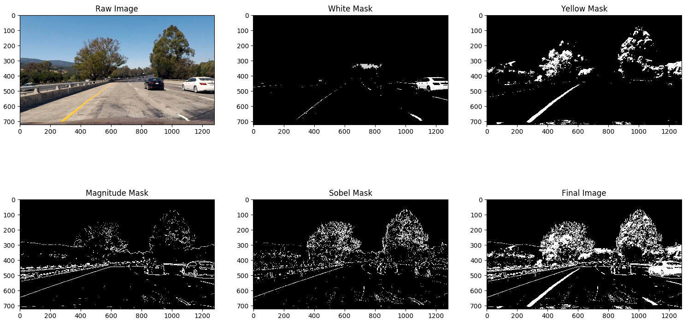
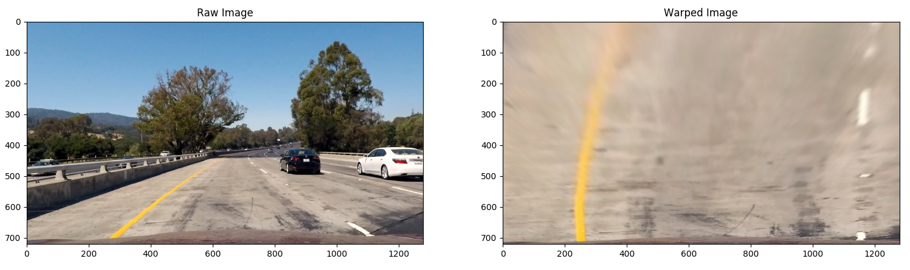
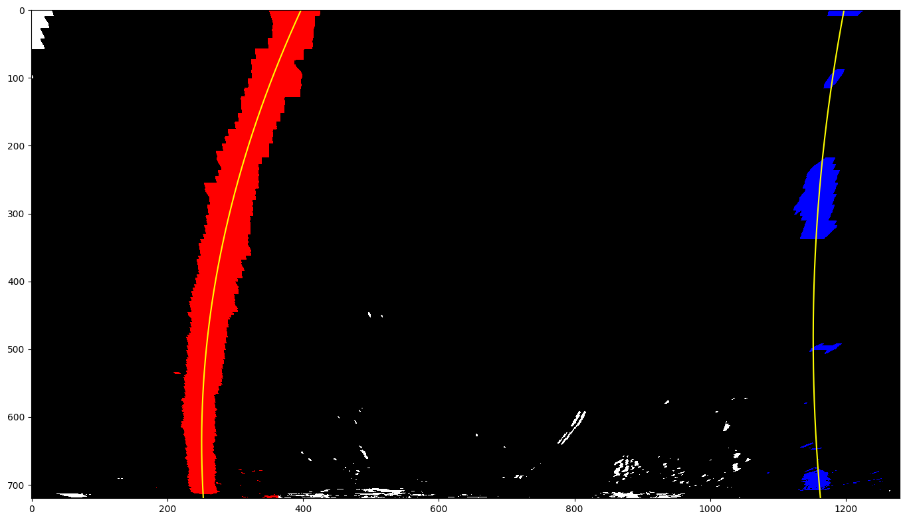
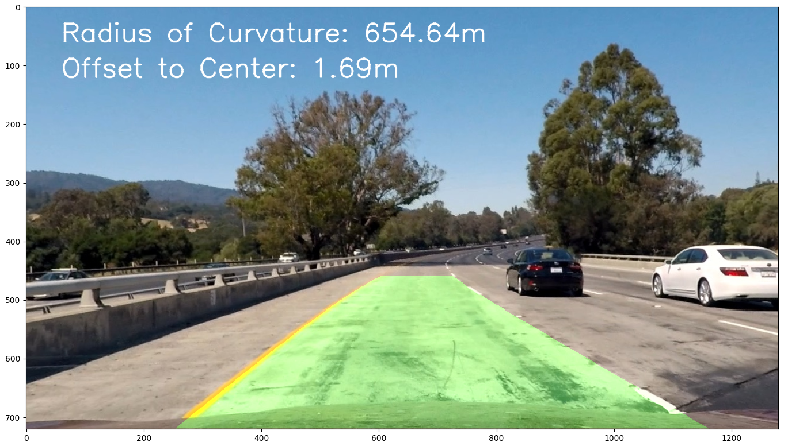

## Writeup - Project: Advanced Lane Finding

The goals / steps of this project are the following:

* Compute the camera calibration matrix and distortion coefficients given a set of chessboard images.
* Apply a distortion correction to raw images.
* Use color transforms, gradients, etc., to create a thresholded binary image.
* Apply a perspective transform to rectify binary image ("birds-eye view").
* Detect lane pixels and fit to find the lane boundary.
* Determine the curvature of the lane and vehicle position with respect to center.
* Warp the detected lane boundaries back onto the original image.
* Output visual display of the lane boundaries and numerical estimation of lane curvature and vehicle position.

[//]: # (Image References)

[image1]: ./camera_cal/calibration1.jpg "Raw"
[image1_1]: ./output_images/undist_calibration1.jpg "Undistorted"
[image2]: ./test_images/test1.jpg "Road Transformed"
[image3]: ./examples/binary_combo_example.jpg "Binary Example"
[image4]: ./examples/warped_straight_lines.jpg "Warp Example"
[image5]: ./examples/color_fit_lines.jpg "Fit Visual"
[image6]: ./examples/example_output.jpg "Output"
[video1]: ./project_video.mp4 "Video"

## [Rubric](https://review.udacity.com/#!/rubrics/571/view) Points

### Camera Calibration

#### 1. Briefly state how you computed the camera matrix and distortion coefficients. Provide an example of a distortion corrected calibration image.

The code for this step is contained in function `calibrate_camera()` in lines 20 through 80 of the file called `advanced_lane_detector.py`.

Since we don't need to calibrate the camera every time before use, this function first checks if the calibration is once done and a calib.json file exists. If not, I use the the function findChessboardCorners() to find and draw corners in an image of a chessboard pattern.

I start by preparing "object points", which will be the (x, y, z) coordinates of the chessboard corners in the world. Here I am assuming the chessboard is fixed on the (x, y) plane at z=0, such that the object points are the same for each calibration image.  Thus, `objp` is just a replicated array of coordinates, and `objpoints` will be appended with a copy of it every time I successfully detect all chessboard corners in a test image.  `imgpoints` will be appended with the (x, y) pixel position of each of the corners in the image plane with each successful chessboard detection.  

I then used the output `objpoints` and `imgpoints` to compute the camera calibration and distortion coefficients using the `cv2.calibrateCamera()` function.  I applied this distortion correction to the test image using the `cv2.undistort()` function and obtained this result: 

| Raw Image | Undistorted Image |
| :--: | :---: |
|| |

### Pipeline (single images)

#### 1. Provide an example of a distortion-corrected image.

To apply the distortion correction I get the calibration parameters and use the `cv2.undistort()` as mentioned in the last step. Here is an example chosen from the test_images:

| Raw Image | Undistorted Image |
| :--: | :---: |
|| |

#### 2. Describe how (and identify where in your code) you used color transforms, gradients or other methods to create a thresholded binary image.  Provide an example of a binary image result.

I used a combination of color and gradient thresholds to generate a binary image (thresholding steps at lines 83 through 241 in `advanced_lane_detector.py`). The binarization processes are seperately defined in functions `abs_sobel_thresh()`, `mag_threshold()`, `dir_threshold()`, `hsv_threshold()`. But the threshold on the computed direction of gradient is not used since I find no benefit using this method for final results.

Here's an example of my output for this step.



#### 3. Describe how (and identify where in your code) you performed a perspective transform and provide an example of a transformed image.

The code for my perspective transform includes a function called `perspective_transform()`, which appears in lines 244 through 292 in the file `advanced_lane_detector.py`.  The `perspective_transform()` function takes as inputs an image (`img`), as well as source (`src`) and destination (`dst`) points.  I chose the hardcode the source and destination points in the following manner:

```python
src = np.float32(
    [[(img_size[1] / 2) - 200, (img_size[0] / 2) + 100],
     [(img_size[1] / 2) + 200, (img_size[0] / 2) + 100],
     [img_size[1], img_size[0]],
     [0, img_size[0]]])
dst = np.float32(
    [[0, 0],
     [img_size[1], 0],
     [img_size[1], img_size[0]],
     [0, img_size[0]]])
```

This resulted in the following source and destination points:

| Source        | Destination   | 
|:-------------:|:-------------:| 
| 440, 460      | 0, 0          | 
| 840, 460      | 1280, 0       |
| 1280, 720     | 1280, 720     |
| 0, 720        | 0, 720        |

I verified that my perspective transform was working as expected by drawing the `src` and `dst` points onto a test image and its warped counterpart to verify that the lines appear parallel in the warped image.



#### 4. Describe how (and identify where in your code) you identified lane-line pixels and fit their positions with a polynomial?

Then I applied two functions to identify the lane-line pixels according to the lesson material. The first function `fit_polynomial_sliding_windows()` (in lines 81 through 260 in `line.py`) use the sliding window to generate the pixels with a serie of small windows and fit my lane lines with a 2-nd order polynomial, while the second function `fit_polynomial_from_prior()` (in lines 263 through 406 in `line.py`) use the a-prior information stored the the class Line so the pixels generated by the last iteration could be reused. This is an image showing the generated pixels, the red pixels are from the left lane while the blue pixels from right lane:



#### 5. Describe how (and identify where in your code) you calculated the radius of curvature of the lane and the position of the vehicle with respect to center.

In the class `Line` I defined the functions `measure_curvature_pixels()` (in lines 50 through 53 in `line.py`) and `measure_curvature_meters()` (in lines 55 through 58 in `line.py`) to calculate the radius of curvature of the lane. This attribute will be updated everytime a new iteration is finised. In the main function, I compuete the average of two lanes and print it onto the output frame. For the position of the vehicle w.r.t. center, I first get the two base position of detected lane lines, then compute the 

#### 6. Provide an example image of your result plotted back down onto the road such that the lane area is identified clearly.

I implemented this step in lines 295 through 356 in my code in `advanced_lane_detector.py` in the function `draw()`.  Here is an example of my result on a test image:



---

### Pipeline (video)

#### 1. Provide a link to your final video output.  Your pipeline should perform reasonably well on the entire project video (wobbly lines are ok but no catastrophic failures that would cause the car to drive off the road!).

Here's a [link to my video result](./out.mp4)

---

### Discussion

#### 1. Briefly discuss any problems / issues you faced in your implementation of this project.  Where will your pipeline likely fail?  What could you do to make it more robust?

In the output video, it is clear that sometimes the left lane is not detected. I think the reason is the binarization step. Because of the shadow and the discontinuity of the lane, the detector does not work well.

One solution is to tune the parameters so the binarization result could also be better.